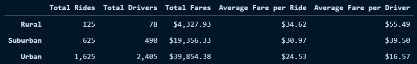
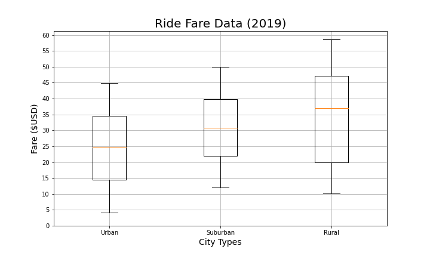

# PyBer with Matplotlib

## Overview of PyBer Project

This project was commissioned by PyBer - a Python-based ride-sharing app company - to analyze differences and disparities in numbers of drivers, numbers of riders, and total and average fares, between Urban, Suburban, and Rural cities.

### Purpose

Recently hired by PyBer as data analysts, we were tasked by V. Isualize, the CEO, to analyze PyBer's data on Urban, Suburban, and Rural cities and prepare a presentation for her. This included the total number of rides, the total number of drivers, the total amount of fares, the average fare per ride, the average fare per driver, and the total fare by city type (Urban, Suburban, or Rural). In analyzing this data, PyBer hopes to further increase access to ride-sharing services and help determine determine affordability to underserved neighborhoods and communities. 

## Results

Through our analysis, we found large disparities in PyBer's metrics between Urban, Suburban, and Rural, as seen below:

### Total Rides by City Type

As shown, 94.7% of PyBer rides are taken in Urban and Suburban cities, with Rural cities representing only 5.3% PyBer interactions. In gross terms, only 125 rides were taken in Rural cities, compared to 625 in Suburban cities, and 1,625 in Urban areas. 

This suggests issues with PyBer's expansion into Rural communities, either due to pricing, low population densities, lack of necessity due to inbuilt infrastructure, or some combination thereof.

### Total Drivers by City Type

The vast majority of drivers, 80.9%, are located in Urban cities, with Suburban cities making up 16.5% of PyBer's driver pool and Rural cities trailing far behind with a mere 2.6% of drivers. In gross terms, there were 2,405 drivers in Urban cities, 490 in Suburban ones, and only 78 in Rural areas.

As with the total ride count, drivers are concentrated within Urban cities, leaving Suburban and Rural communities lagging behind. Interestingly, Urban and Rural cities have inverse relationships between the total number of rides and the total number of drivers within each city type, presenting separate issues for PyBer.

For Urban cities, there were far more drivers than rides taken overall. While this can ensure riders are quickly connected with a driver, it can potentially have deleterious down-stream effects to PyBer's driving pools down the line if drivers are unable to get work.

Conversely, for Rural cities, there were less drivers than rides taken. Although this may be beneficial for the drivers in Rural areas as they will get more work, if the drivers to rides ratio trends too low, then Rural customers may move away from PyBer due to increases in wait times.

### Total Fares by City Type

Urban cities represent most of PyBer's revenue, with a total of $39,854.38 being generated from fares within them. There is about a $20,000 step from Urban to Suburban cities and about a $15,0000 step from Suburban to Rural cities, which have generated a total of $19,356.33 and $4,327.93, respectively.

This result in unsurprising since, as previously discussed, the majority of rides and drivers are located within Urban cities. However, it _is_ interesting that the increase in revenue is not linear. Despite Urban cities having 2.6 times as many rides as Suburban ones, they only produced ~2 times the amount of total fares.

### Average Fare per Ride by City Type

The average fare per ride by city type is:

Rural:  $34.62

Suburban: $30.97

Urban: $24.53

Additionally, as we can see in the box plot below, the range of fares for each city type are quite large. 

Interestingly, although the fares per ride in Urban and Suburban cities appear to be normally distributed (their means and medians are about the same), fares in Rural cities are skewed left. This suggests that customers in Rural areas are generally paying higher fares per ride within their range. 

### Average Fare per Driver by City Type

The average fare per driver by city type is:

Rural: $55.49

Suburban: $39.50

Urban: $16.57

As we can see, on average, each driver in Rural cities has gotten a fare of $55.49, whereas in Urban cities, each driver on average has gotten a fare of $16.57. This is unsurprising, as it tracks with our earlier results on driver and ride counts. 

### Total Weekly Fares by City Type

As seen in the graph above, despite having a comparatively low average fare per driver and per ride, Urban cities have consistently brought in the most gross fare on a weekly basis. This makes sense as they had the most rides by far, which could make up for relatively lower fares. 

Conversely, Rural cities have consistently brought in less than $500 per week in gross fare. Despite having the highest fares of the city types, they do not give PyBer enough traffic generate larger total fare amounts.

## Summary
3 business recommendations to the CEO for addressing any disparities between city types

1) PyBer's infrastructure should be increased in Rural and Suburban cities. They vastly lag behind Urban cities in driver count, ride count, and fare price.

2) Driver's concetrated in Urban cities, with there being more drivers than total rides taken. While this can ensure riders are quickly connected with a driver, it can potentially have deleterious effects to driving pools down the line if drivers are unable to get work. Recommend increase marketing and expansion of services to close this gap.

3) 

