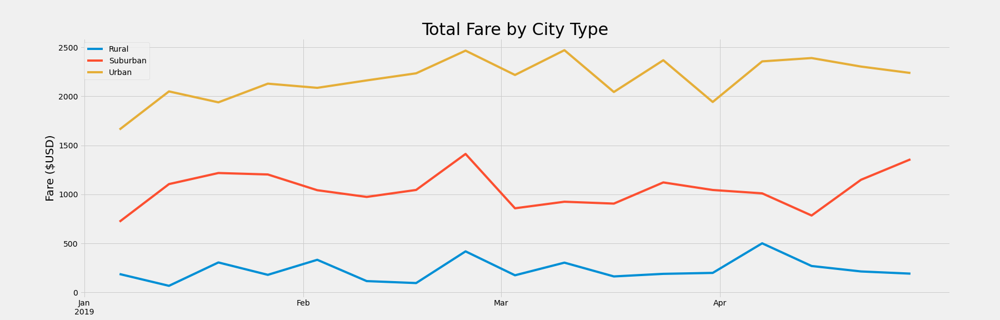

# PyBer with Matplotlib

## Overview of PyBer Project

This project was commissioned by PyBer - a Python-based ride-sharing app company - to analyze differences and disparities in numbers of drivers, numbers of riders, and total and average fares, between Urban, Suburban, and Rural cities.

### Purpose

Recently hired by PyBer as data analysts, we were tasked by V. Isualize, the CEO, to analyze PyBer's data on Urban, Suburban, and Rural cities and prepare a presentation for her. This included the total number of rides, the total number of drivers, the total amount of fares, the average fare per ride, the average fare per driver, and the total fare by city type (Urban, Suburban, or Rural). In analyzing this data, PyBer hopes to further increase access to ride-sharing services and help determine determine affordability to underserved neighborhoods and communities. 

## Results
Describe the differences in ride-sharing data between city types

### Total Rides
Rural: 125
Suburban: 625
Urban: 1,625

### Total Drivers
Rural: 78
Suburban: 490
Urban: 2,405

### Total Fares
Rural: $4,327.93 
Suburban: $19,356.33
Urban: $39,854.38

### Average Fare per Ride
Rural:  $34.62
Suburban: $30.97
Urban: $24.53

### Average Fare per Driver
Rural: $55.49
Suburban: $39.50
Urban: $16.57

### Total Fare by City Type

## Summary
3 business recommendations to the CEO for addressing any disparities between city types

